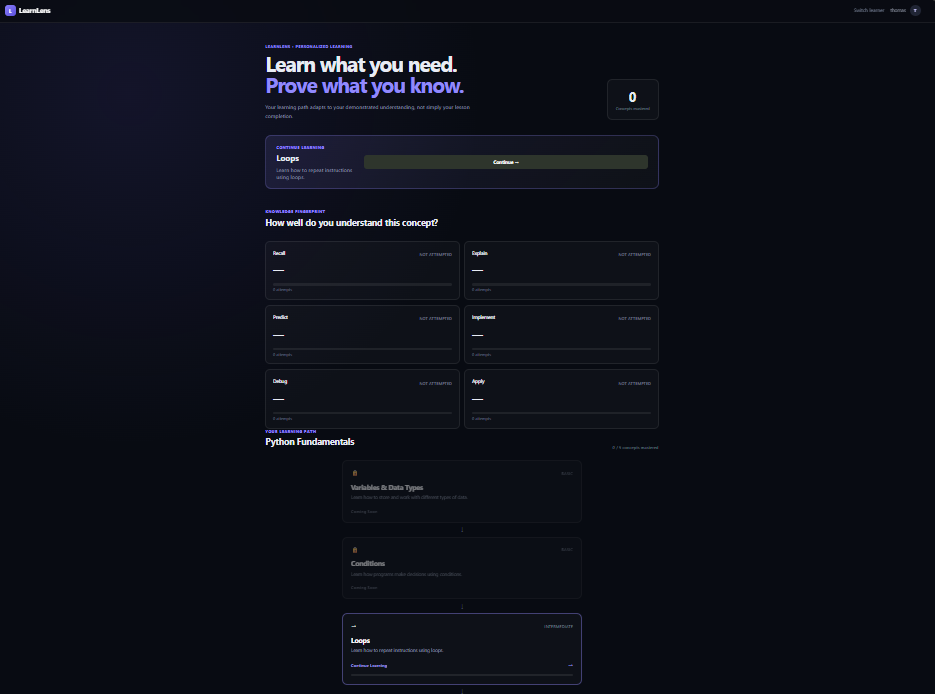
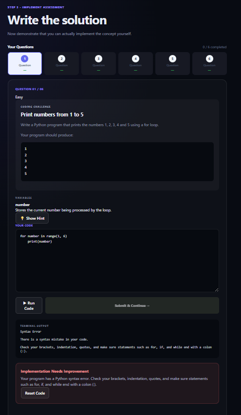
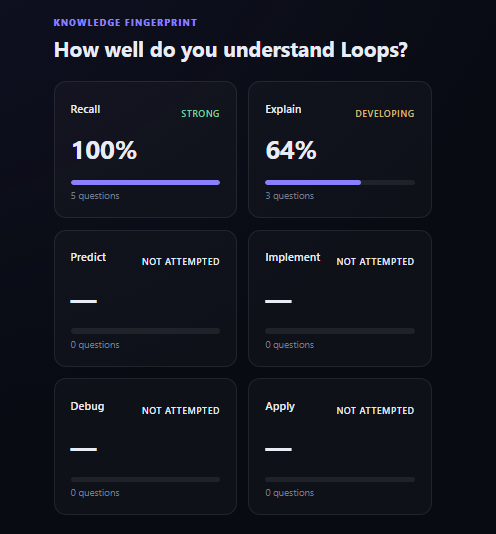
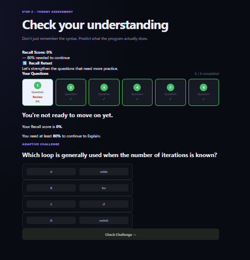

# LearnLens

### From Learning to Proof of Understanding

An AI-enabled adaptive learning and learning-verification platform that goes beyond traditional quiz scores to build evidence of **how a learner understands a concept, where they struggle, and what they should practice next**.

LearnLens combines theory assessment, coding assessment, code execution, mistake tracking, Knowledge Fingerprinting, adaptive challenges, and learning verification into a continuous learning workflow.

Built for **Prasunethon 2.0 — Round 2** by **Team Tech Nova**.

---

## Live Demo

- **Frontend Application:** [Live Application](https://learnlens-eight.vercel.app)
- **GitHub Repository:** [Source Code](https://github.com/mariadorthy/learnlens)

> The live application demonstrates the core LearnLens learning and verification workflow.

---

## Presentation & Demo

### Presentation

The complete project presentation is available here:

[View LearnLens Presentation](./presentation/LearnLens_Prasunethon2.0.pdf)

### Video Demo

The video demonstration walks through the complete LearnLens workflow:

```text
Concept Selection
      ↓
Learning Roadmap
      ↓
Assessment
      ↓
Learner Attempt
      ↓
Knowledge Fingerprint
      ↓
Adaptive Challenge
      ↓
Reassessment
      ↓
Proof-of-Learn
```

[Watch the Demo](https://canva.link/e56lve479nrlgby)

---

## Overview

Traditional learning platforms often follow a simple model:

```text
Learn → Quiz → Score → Completion
```

However, a correct answer or completed lesson does not always prove that a learner truly understands a concept.

A learner may:

* Remember a definition but fail to apply it
* Understand theory but struggle to implement it
* Solve a familiar question but fail on a different variation
* Repeatedly make similar coding mistakes
* Complete a lesson without demonstrating practical understanding

LearnLens addresses this gap by treating learner attempts, responses, execution results, and mistakes as **learning evidence**.

The core idea is:

```text
Attempt
   ↓
Evidence
   ↓
Understanding
   ↓
Adaptive Action
   ↓
Proof-of-Learn
```

The system uses available learning evidence to identify areas that need reinforcement and guide the learner toward an appropriate next challenge.

---

## Why LearnLens?

The central question in learning is not only:

> **"Did the learner get it right?"**

A stronger question is:

> **"What does the learner actually understand, and what should they prove next?"**

LearnLens is designed around this distinction.

Instead of treating each assessment as an isolated score, the platform connects:

```text
Learning
   ↓
Attempt
   ↓
Evidence
   ↓
Analysis
   ↓
Knowledge State
   ↓
Adaptive Action
   ↓
Proof-of-Learn
```

This creates a learning loop where assessment results and mistakes can contribute to the learner's next learning action.

---

## What Makes LearnLens Different?

| Traditional Learning                | LearnLens                                     |
| ----------------------------------- | --------------------------------------------- |
| Lesson completion                   | Demonstrated understanding                    |
| Single quiz score                   | Multi-dimensional Knowledge Fingerprint       |
| Mistakes disappear after submission | Mistakes become learning evidence             |
| Same learning path for everyone     | Adaptive learning progression                 |
| Correct answer indicates success    | Evidence contributes to learning verification |
| Mostly predefined practice          | Challenges can target identified weaknesses   |

The goal is to move from **completion-based learning** toward **evidence-based learning**.

---

## Core Features

LearnLens focuses on six core MVP capabilities.

### 1. Adaptive Learning Roadmap

LearnLens provides structured learning progression around concepts and topics.

```text
Basic
  ↓
Intermediate
  ↓
Advanced
```

The roadmap supports progression based on learning evidence rather than simply completing a lesson.

#### Key capabilities

* Concept-based learning
* Structured progression
* Progress tracking
* Reinforcement of weak areas
* Adaptive progression

---

### 2. Theory + Coding Assessment

LearnLens evaluates understanding through multiple forms of assessment.

#### Theory Assessment

Learners may be asked to:

* Explain a concept
* Predict behavior or output
* Answer conceptual questions
* Explain why an approach works

#### Coding Assessment

Learners may be asked to:

* Write code
* Modify code
* Debug code
* Solve programming problems

This allows LearnLens to collect evidence from both **conceptual understanding and practical implementation**.

---

### 3. Code Execution & Mistake Tracking

LearnLens allows learners to submit Python code as part of coding assessments.

The current implementation uses:

* Python `subprocess` for code execution
* Python `tempfile` for temporary source files
* Execution output and errors as assessment evidence

The workflow is:

```text
Code Submission
      ↓
Temporary File
      ↓
Python Execution
      ↓
Output / Error
      ↓
Assessment Result
      ↓
Learning Evidence
```

Instead of treating an incorrect submission as simply "wrong", the attempt can contribute to the learner's learning history and mistake analysis.

> **Implementation note:** The current MVP does not implement a dedicated sandbox or isolated container for code execution. Code execution is currently performed using Python `subprocess` and temporary files. A secure sandboxed execution environment is considered future scope.

---

### 4. Knowledge Fingerprint

The **Knowledge Fingerprint** is one of LearnLens's central concepts.

Rather than representing understanding using only one score, LearnLens considers different dimensions of understanding:

```text
Recall
Explain
Predict
Implement
Debug
Apply
```

For example:

```text
Concept: Functions

Recall       → Strong
Explain      → Strong
Predict      → Moderate
Implement    → Moderate
Debug        → Weak
Apply        → Weak
```

The Knowledge Fingerprint provides a more meaningful view of where understanding is strong and where further learning evidence is needed.

#### Why it matters

Two learners can achieve similar overall assessment results while having very different strengths and weaknesses.

The Knowledge Fingerprint is intended to expose those differences and provide a basis for targeted practice.

---

### 5. Adaptive Challenges

The next challenge can be influenced by an identified learning weakness.

For example:

```text
Implementation Weak
        ↓
Coding Challenge
        ↓
Attempt
        ↓
Reassessment
```

A learner with a conceptual weakness may instead receive:

```text
Conceptual Weakness
        ↓
Explanation / Theory Challenge
        ↓
Attempt
        ↓
Reassessment
```

This connects practice with observed learning evidence.

---

### 6. Proof-of-Learn

Completing a lesson does not automatically mean that understanding has been demonstrated.

LearnLens uses available evidence from learner interactions and assessments to support learning verification.

```text
Learning
   ↓
Attempt
   ↓
Evidence
   ↓
Assessment / Analysis
   ↓
Proof-of-Learn
```

If further learning is needed:

```text
Weakness
   ↓
Targeted Reinforcement
   ↓
Adaptive Challenge
   ↓
Reassessment
```

If sufficient understanding is demonstrated:

```text
Concept Demonstrated
        ↓
Next Concept
```

The purpose of Proof-of-Learn is to move the learning experience from:

```text
Completion
```

toward:

```text
Demonstrated Understanding
```

---

## AI in LearnLens

AI is used as an **intelligence and analysis layer** within the learning workflow rather than as a standalone chatbot.

The current implementation integrates **Google GenAI** through the backend AI analysis modules.

#### AI-Assisted Analysis

The AI layer supports analysis of learner attempts and mistakes within the implemented workflow.

Depending on the assessment and implementation path, analysis can help identify possible:

* Conceptual mistakes
* Logical mistakes
* Syntax-related issues
* Reasoning issues
* Incomplete understanding
* Other patterns represented by the application's analysis logic

The backend includes dedicated analysis components such as:

```text
ai_analysis
analyze_mistake
```

The overall role of AI is:

```text
Learner Attempt
      ↓
Assessment / Execution Result
      ↓
AI-Assisted Analysis
      ↓
Possible Mistake / Learning Gap
      ↓
Learning Evidence
      ↓
Adaptive Action
```

> **Important:** The current MVP intentionally keeps AI focused on supporting the learning and analysis workflow. LearnLens does not claim advanced autonomous learner modeling or fully generative adaptive learning capabilities that are not implemented in the current version.

---

## Example Learning Journey

A typical LearnLens learning journey follows the concept selected by the learner:

```text
Learner selects a concept
        ↓
Studies the concept
        ↓
Completes assessment
        ↓
Submits attempt
        ↓
System evaluates response
        ↓
Knowledge Fingerprint updated
        ↓
Weak areas identified
        ↓
Adaptive challenge
        ↓
Reassessment
        ↓
Proof-of-Learn
        ↓
Next concept
```

The important distinction is that the workflow does not stop at:

```text
Quiz → Score
```

Instead, it follows:

```text
Attempt
   ↓
Evidence
   ↓
Understanding
   ↓
Adaptive Action
   ↓
Proof-of-Learn
```

---

## Application Workflow

The complete LearnLens workflow can be represented as:

```text
                  Learner
                     │
                     ▼
              Concept Selection
                     │
                     ▼
               Learning Roadmap
                     │
                     ▼
           Theory / Coding Assessment
                     │
                     ▼
                Learner Attempt
                     │
                     ▼
              Evidence Collection
                     │
                     ▼
           Response / Code Analysis
                     │
                     ▼
             Knowledge Fingerprint
                     │
                     ▼
              Weakness Detection
                     │
                     ▼
              Adaptive Challenge
                     │
                     ▼
                 Reassessment
                     │
                     ▼
               Proof-of-Learn
                  /       \
                 /         \
                ▼           ▼
        Reinforcement    Progress
                              │
                              ▼
                         Next Concept
```

#### Core Learning Loop

```text
Attempt
   ↓
Evidence
   ↓
Understanding
   ↓
Adaptive Action
   ↓
Proof-of-Learn
```

---

## Screenshots

### Learning Roadmap



### Assessment



### Knowledge Fingerprint



### Adaptive Challenge



For additional screenshots and detailed UI documentation, see [`docs/README.md`](./docs/README.md).

---

## Technology Stack

### Frontend

| Technology        | Purpose                                |
| ----------------- | -------------------------------------- |
| **React**         | User interface development             |
| **Vite**          | Frontend development and build tooling |
| **React Router**  | Client-side routing and navigation     |
| **Axios / Fetch** | Communication with backend APIs        |

### Backend

| Technology     | Purpose                                         |
| -------------- | ----------------------------------------------- |
| **Python**     | Backend application development                 |
| **FastAPI**    | REST API development and backend framework      |
| **Uvicorn**    | ASGI server used to run the FastAPI application |
| **SQLAlchemy** | Database interaction and ORM                    |
| **Pydantic**   | Request validation and data modelling           |
| **pwdlib**     | Password hashing                                |

### AI & Analysis

| Component             | Purpose                                           |
| --------------------- | ------------------------------------------------- |
| **Google GenAI**      | AI-assisted learner response and mistake analysis |
| **`ai_analysis`**     | AI-related analysis logic                         |
| **`analyze_mistake`** | Mistake-analysis workflow                         |

### Database

| Technology         | Purpose                                 |
| ------------------ | --------------------------------------- |
| **SQLite**         | Application database                    |
| **SQLAlchemy ORM** | Database models and database operations |

The current database configuration uses:

```python
DATABASE_URL = "sqlite:///./learnlens.db"
```

### Code Execution

| Component               | Purpose                            |
| ----------------------- | ---------------------------------- |
| **Python `subprocess`** | Executes submitted Python code     |
| **Python `tempfile`**   | Creates temporary source files     |
| **Execution results**   | Provides output and error evidence |

---

## Architecture

At a high level, LearnLens follows an evidence-driven architecture:

```text
┌─────────────────────────────┐
│        Learner / UI         │
│       React + Vite          │
└──────────────┬──────────────┘
               │
               ▼
┌─────────────────────────────┐
│     FastAPI Backend         │
│     Learning & Assessment   │
└──────────────┬──────────────┘
               │
               ▼
┌─────────────────────────────┐
│      Evidence Collection    │
│ Responses / Code / Errors   │
└──────────────┬──────────────┘
               │
        ┌──────┴───────┐
        ▼              ▼
┌──────────────┐  ┌────────────────┐
│    SQLite    │  │  Google GenAI  │
│  + SQLAlchemy│  │ Analysis Layer │
└──────────────┘  └────────────────┘
        │              │
        └──────┬───────┘
               ▼
┌─────────────────────────────┐
│     Knowledge Fingerprint   │
└──────────────┬──────────────┘
               │
               ▼
┌─────────────────────────────┐
│      Adaptive Decision      │
└──────────────┬──────────────┘
               │
               ▼
┌─────────────────────────────┐
│     Next Learning Action    │
└─────────────────────────────┘
```

#### Architectural Principle

```text
Interaction
    ↓
Evidence
    ↓
Analysis
    ↓
Knowledge State
    ↓
Adaptive Decision
    ↓
Next Challenge
```

For detailed architecture, see [`System Architecture`](./docs/architecture.md).

---

## Project Structure

The root README intentionally keeps the structure compact. Detailed implementation structure is available in the documentation.

```text
LearnLens/
├── src/          # React frontend
├── public/       # Static assets
├── backend/      # FastAPI backend
├── docs/         # Project documentation
├── package.json
├── .env.example
└── README.md
```

> The final structure should always match the actual repository implementation.

---

## Documentation

Detailed project documentation is available in the [`docs`](./docs/README.md) directory.

| Documentation                                            | Description                                       |
| -------------------------------------------------------- | ------------------------------------------------- |
| [Project Overview](./docs/project-overview.md)           | Introduction and project objectives               |
| [Problem Statement](./docs/problem-statement.md)         | Problem addressed by LearnLens                    |
| [Solution](./docs/solution.md)                           | Proposed solution and approach                    |
| [Features](./docs/features.md)                           | Detailed explanation of the six MVP features      |
| [System Architecture](./docs/architecture.md)            | Technical architecture and data flow              |
| [Testing](./docs/testing.md)                             | Manual testing approach and results               |
| [Deployment](./docs/deployment.md)                       | Deployment and hosting information                |

---

## Installation

### Prerequisites

Make sure the required frontend and backend runtimes are installed before starting the project.

You will need:

* Node.js and npm
* Python
* A configured Google GenAI API key for AI-assisted functionality

---

### Clone Repository

```bash
git clone https://github.com/mariadorthy/learnlens.git
cd LearnLens
```

---

### Frontend Setup

Install the frontend dependencies:

```bash
npm install
```

Run the frontend development server:

```bash
npm run dev
```

The frontend uses Vite for local development.

---

### Backend Setup

Navigate to the backend directory:

```bash
cd backend
```

Create a Python virtual environment if desired:

```bash
python -m venv venv
```

Activate the virtual environment.

#### Windows

```bash
venv\Scripts\activate
```

#### macOS / Linux

```bash
source venv/bin/activate
```

Install the backend dependencies using the dependency configuration included in the repository.

Then start the FastAPI backend with Uvicorn:

```bash
uvicorn main:app --reload
```

> If the actual FastAPI entry point differs in the repository, use the corresponding module and application object.

The backend uses SQLite and creates/uses the configured `learnlens.db` database file.

---

## Environment Variables

Create a `.env` file based on `.env.example`.

The project may use variables such as:

```env
GEMINI_API_KEY=
FRONTEND_URL=
VITE_API_URL=
```

> Only variables required by the current implementation should be included in the final `.env.example`.

---

## Deployment

LearnLens is deployed and accessible through the live application.

The high-level deployment flow is:

```text
Source Code
     ↓
Build
     ↓
Deployment Platform
     ↓
Live Application
```

Detailed deployment information is available in [`docs/deployment.md`](./docs/deployment.md).

---

## Testing

The current MVP has been tested primarily through **manual testing**.

Testing covered:

* Frontend interactions
* FastAPI API behavior
* Request and response handling
* Theory assessments
* Coding assessments
* Code execution
* Mistake tracking
* Knowledge Fingerprint updates
* Adaptive challenges
* Proof-of-Learn workflow
* Error handling
* End-to-end learner workflow

> The current project does not claim an automated unit or integration testing suite. Testing was performed manually by running the application, interacting with the frontend, submitting assessments and code, and verifying the resulting frontend and backend behavior.

Detailed testing information is available in [`docs/testing.md`](./docs/testing.md).

---

## Future Scope

The current MVP focuses on the core adaptive learning and learning-verification workflow.

Potential future extensions include:

* Advanced AI-based learner modeling
* PDF/document-based learning using RAG
* Previous-year question analysis
* Exam priority prediction
* Teacher and mentor analytics
* Class-level misconception analysis
* Additional programming languages
* More advanced adaptive challenge generation
* Learning-resource recommendations
* Secure sandboxed code execution
* Institution-level learning analytics

These capabilities are considered **future scope** unless explicitly implemented in the current version.

---

## Core MVP

The current MVP focuses on six capabilities:

```text
1. Adaptive Learning Roadmap
              ↓
2. Theory + Coding Assessment
              ↓
3. Code Execution & Mistake Tracking
              ↓
4. Knowledge Fingerprint
              ↓
5. Adaptive Challenges
              ↓
6. Proof-of-Learn
```

Together, these features form the central LearnLens learning loop:

```text
Learn
  ↓
Attempt
  ↓
Evidence
  ↓
Analyze
  ↓
Understand
  ↓
Adapt
  ↓
Prove
  ↓
Progress
```

---

## Hackathon Demonstration

The recommended demonstration flow is a complete learner journey:

```text
Open LearnLens
      ↓
Select a Concept
      ↓
Follow Learning Roadmap
      ↓
Study the Concept
      ↓
Take Assessment
      ↓
Submit an Attempt
      ↓
Observe Evaluation / Feedback
      ↓
View Knowledge Fingerprint
      ↓
Identify a Weak Area
      ↓
Receive Adaptive Challenge
      ↓
Complete Reassessment
      ↓
Demonstrate Proof-of-Learn
      ↓
Observe Updated Learning State
      ↓
Continue to Next Concept
```

The demonstration is designed to communicate the central idea behind LearnLens:

> **Learning should not end with a score. It should produce evidence of understanding.**

---

## Project Information

| Field            | Details                                                       |
| ---------------- | ------------------------------------------------------------- |
| **Project Name** | LearnLens                                                     |
| **Tagline**      | From Learning to Proof of Understanding                       |
| **Hackathon**    | Prasunethon 2.0 — Round 2                                     |
| **Team**         | Tech Nova                                                     |
| **Category**     | Education / Applied AI                                        |
| **Project Type** | AI-Enabled Adaptive Learning & Learning-Verification Platform |
| **Status**       | MVP / Hackathon Prototype                                     |

---

## Project Status

**Development Stage:** Prasunethon 2.0 — Round 2

LearnLens is being developed as an MVP demonstrating the concept of **adaptive learning through learning evidence and proof of understanding**.

The current implementation prioritizes demonstrating the complete learner workflow rather than expanding into capabilities that are not yet implemented.

The project is intentionally positioned around what is currently functional, while more advanced capabilities are documented as future scope.

---

## License

This project is developed for **Prasunethon 2.0 — Round 2** and demonstration/evaluation purposes.

Unless a license is explicitly provided in the repository, the source code should not be assumed to be available for redistribution, modification, or commercial use without permission.

---
